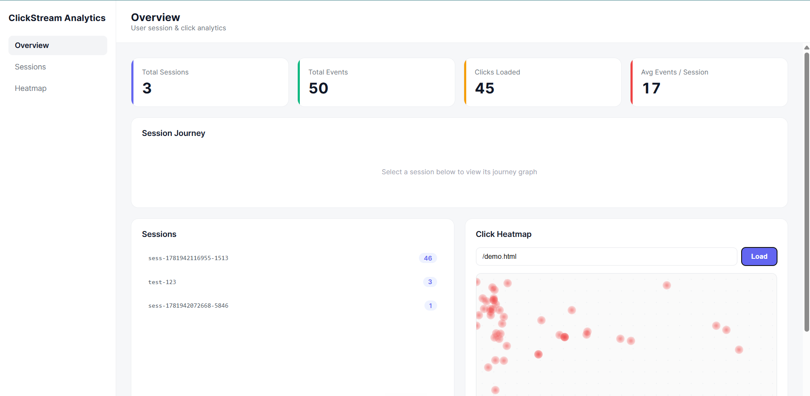
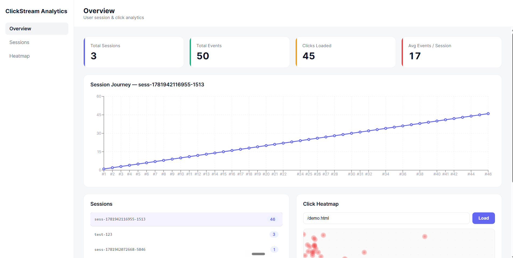
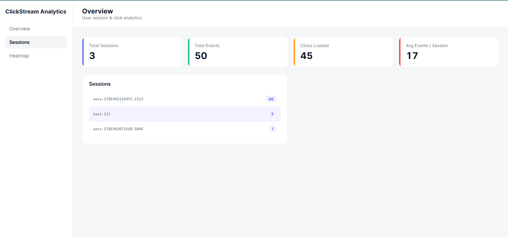
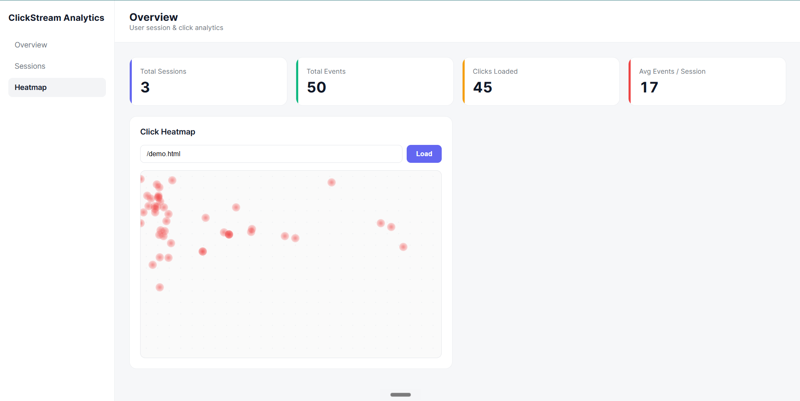

# ClickStream Analytics

A full-stack user analytics application that tracks user interactions (page views and clicks) on a webpage and visualizes them in a dashboard — including per-session user journeys and a click heatmap.

Built as part of the Full Stack Engineer hiring assignment for CausalFunnel.

## Screenshots






## Live Demo

- **Dashboard (frontend):** <https://clickstream-analytics-pi.vercel.app/>
- **API (backend):** <https://clickstream-analytics.onrender.com>
- **Demo page (for generating tracked events):** open `Backend/demo.html` locally (see setup)


## Tech Stack

- **Frontend:** React (Vite), Recharts for the journey chart
- **Backend:** Node.js, Express
- **Database:** MongoDB
- **ODM:** Mongoose
- **Tracking script:** Vanilla JavaScript
- **Hosting:** Vercel (frontend), Render (backend), MongoDB Atlas (database)

## Architecture

```
Tracking script (browser)  ──POST events──►  Express API  ──►  MongoDB
                                                  ▲
React dashboard  ──GET sessions / events / clicks─┘
```

Events are the single unit of data. Every user action (a page view or a click) is stored as one document in an events collection, tagged with a "session_id" that groups all actions from one visit. Sessions are not stored separately, they are derived using a MongoDB aggregation that groups events by "session_id".

## API Endpoints

| Method | Endpoint | Description |
|--------|----------|-------------|
| POST | `/api/events` | Receive and store a tracked event |
| GET | `/api/sessions` | List all sessions with their total event counts |
| GET | `/api/sessions/:id/events` | Get all events for one session, ordered by time (the user journey) |
| GET | `/api/clicks?page_url=<url>` | Get all click events for a page (used by the heatmap) |

## Event Data-Model

```js
{
  session_id: String,   // groups all events from one visit
  event_type: String,   // "page_view" or "click"
  page_url:   String,
  timestamp:  Date,      // auto-set on creation
  x: Number,             // click X coordinate 
  y: Number              // click Y coordinate 
}
```

## Features

- **Event tracking:** a vanilla-JS script captures page views and clicks (with x/y coordinates), assigns a persistent `session_id` via `localStorage`, and sends events to the API.
- **Sessions view:** lists every session with its event count, selecting a session shows its ordered event journey.
- **Heatmap view:** enter a page URL to plot every click on that page as positioned dots.

## Local Setup

### Prerequisites
- Node.js installed
- A MongoDB Atlas connection string

### 1. Clone the repo
```bash
git clone https://github.com/SamarthyaOfficial/clickstream-analytics.git
cd clickstream-analytics
```

### 2. Backend
```bash
cd Backend
npm install
```
Create a `.env` file in `Backend/` with your MongoDB connection string:
```
MONGO_URI=your_mongodb_atlas_connection_string
```
Start the server:
```bash
npm run dev      
# or
node server.js  
```
The API runs on `http://localhost:5000`.

### 3. Frontend
```bash
cd ../Frontend
npm install
npm run dev
```
The dashboard runs on `http://localhost:5173`.

> The frontend reads the backend URL from an "API" constant at the top of "src/App.jsx". It is set to the deployed Render URL for production; change it to `http://localhost:5000` to run fully locally.

### 4. Generate test data
Open `Backend/demo.html` in a browser and click around. Each load and click sends an event to the API, which then appears in the dashboard.

## Assumptions & Trade-offs

- **Sessions are derived, not stored.** Rather than maintaining a separate sessions collection, sessions are computed from events via aggregation. This keeps a single source of truth and avoids data getting out of sync, at the cost of running an aggregation on each sessions request.
- **Heatmap coordinate scaling.** Click coordinates are stored as raw pixel values from the visitor's screen and rendered on the dashboard as a percentage of a reference resolution (1440×900). This keeps dots inside the canvas across screen sizes, but is approximate. A production version would store the viewport dimensions alongside each click and scale accurately.
- **Open CORS.** The API currently accepts requests from any origin for ease of deployment and testing. In production this would be restricted to the known frontend domain.
- **Open database network access.** MongoDB Atlas is set to allow connections from any IP (`0.0.0.0/0`) so the deployed backend and local development both connect easily. Production would restrict this to known server IPs.
- **No authentication.** The assignment scope is tracking and visualization; there is no auth on the API. A production analytics service would add API keys / auth and rate limiting on the events endpoint.
- **Free-tier cold starts.** The backend sleeps on Render's free tier, so the first request after inactivity is slow.

## Possible Future Improvements

- Store viewport size per event for accurate heatmaps
- Add a true density-based heatmap (gradient intensity, not just dots)
- Authentication and per-site API keys
